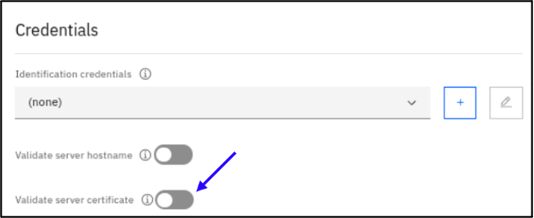
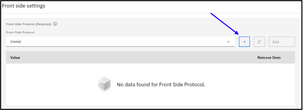

# LAB 3. Content Transformation

In this lab, you will create a fully functional Multi-Protocol gateway service that will transform message

Upon completing this lab, you will have a better understanding of:

- How messages are processed
- The Multi-Protocol Gateway service configuration
- Front-side protocol handlers
- Configuring Processing Policies, Rules, and Actions
- Developing on XSLT to transform the content of the messages

The following image shows the overall idea of this lab. There are REST clients which send requests and backends which are designed to process it. In the middle, there is a DataPower exposing REST facade against a web server as the backend. DataPower has a Multi-Protocol gateway service which accepts RESTful methods requests (GET, PUT, POST, DELETE) from the service consumer. Then, this service will transform the structure of the messages in both ways.


**1.** The first step is to verify that the backend service is up and running. We will use a public web service from public website to echo our HEADER as the backend in this lab.

https://echo.free.beeceptor.com/

**3.** Now that you have verified that the service is accessible and operational, you are ready to configure a Multi-Protocol Gateway that will mediate between your curl HTTP request with that public website. Navigate your browser to the following secure URL:
```
https://127.0.0.1:9090
```

**4.** Put your username and password in the appropriate fields, and then click **Login.**


**5.** Upon successful login, the DataPower Control Panel will be shown.


**6.** Click the Services tab and click on Multi-Protocol Gateway option.


**7.** Click the **Add** button to create a new Muti-Protocol Gateway service. The New Multi-Protocol Gateway form will be displayed.


**8.** In the Multi-Protocol Gateway Name field, type: **test_MPG**


**9.** In the XML Manager section, click the **‘+’** button. The XML Manager form will be displayed.


**10.** In the Name field, type: **test-XMLManager**


**11.** Scroll down to find the User Agent Configuration field, click the **‘+’** button. The User Agent form will be displayed.


**12.** In the Name field, type: **test-UserAgent.** Click the **Apply** button in the upper section of the form.


**13.** A successful message should be displayed. Click the **‘x’** button. Click the **Apply** button.


**14.** A successful message should be displayed. Click the **‘x’** button.


**15.** The new XML Manager should be automatically added to the list of XML Manager.


**16.** In the Processing policy section, click the **‘+’** button. The Configure Multi-Protocol Gateway Style Policy form will be displayed.


**17.** In the Policy Name field, type: **test-StylePolicy.** Then, click the **Add** button to create processing rules.


**18.** In the Rule Name field, type: **test-StylePolicy_request.** In the Rule Direction dropdown, select the option: **Client to Server**


**19.** Click the **Match rule** action to reveal its configuration form in a pop-up window.


**20.**	Click the **‘+’** button. The Matching Rule form will be displayed.


**21.** In the Name field, type: **test-MatchingRule-All**


**22.** Scroll down to find the Rules section, click the **Add** button. The Add Rules form will be displayed.


**23.** Leave the Matching type field as URL. In the URL match field, type: *****. Then, click the **Apply** button.


**24.** The new Matching type should be automatically added.


**25.** Click the **Apply** button in the upper section of the form.


**26.**	A successful message should be displayed. Click the **‘x’** button. The new Matching Rule should be automatically added. Then, click the **Done** button.


**27.**	In the Rule section, click the **Done** button.


**28.** The new Rule should be automatically added. Click the **Add** button to create a response rule.


**29.**	In the Rule Name field, type: **test-StylePolicy_response.** In the Rule Direction dropdown, select the option: **Server to Client.**


**30.**	Click the **Match rule** action to reveal its configuration form in a pop-up window.


**31.**	In the Matching Rule dropdown, select: **test-MatchingRule-All.** Then, click the **Done** button.


**32.**	In the Rule section, click the **Done** button.


**33.**	The new Rule should be automatically added. There should be two (2) rules. Click the **Apply Policy** button to create the style policy.


**34.**	A successful message should be displayed. Click the **‘x’** button. The new Style Policy should be created. Then, click the **‘x’** button in the Configure Multi-Protocol Gateway Style Policy tab.


**35.**	In the Default Backend URL field, type:

```
https://echo.free.beeceptor.com/
```


**36.**	In the TLS client type field, select the option: **Client profile.** Then, select the **‘+’** button in the TLS client profile field.


**37.**	In the Name field, type: **test-TLSClient**


**38.**	Scroll down to the Credentials section. Turn off **Validate server certificate.**



**39.**	Click the **Apply** button in the upper section of the form.


**40.**	A successful message should be displayed.


**41.**	In Response type field, select the option: **PassThrough**


**42.**	In Front side settings section, click the **‘+’** button.



**43.**	In the pop-up list of Front Side Protocol, select the option: **HTTP handler.** The HTTP handler form will be displayed.


**44.**	In the Name field, type: **NumberToWords-HTTPHandler**

**45.**	Leave the Local IP address field as 0.0.0.0. This will cause the front side handler to listen for traffic on all IP addresses defined on the appliance.

**46.**	In the Port field, replace the default port 80 with 8000.


**47.**	In the **Allowed methods and versions** field, select the **GET method**. Click the **Apply** button in the upper section of the form.


**48.**	A successful message should be displayed.


**49.**	The new HTTP FSH should be automatically added to the dropdown list of Front Side Protocol (see below). Then, click the **Add** button.


**50.**	The HTTP FSH should be added to the list of Front Side Protocol (see below).


**51.**	In Request type field, select the option: **Non-XML**


**52.**	Click the **Apply** button in the upper section of the form to activate this new configuration.


**53.**	The service should be created, and the status should be **‘up’**. The Multi-Protocol Gateway.


**54.**	At the top of the browser window, click on the **Save** button.


**55.**	You should see a message that says the domain configuration was successfully saved.


**56.**	Now, it is time to add some actions to the processing rule. Click on the **Edit (pencil)** button in the Processing policy field.


57.	In the rule sections, click on the Rule Name which has direction as “Client to Server”.


**62.**	Click on the **‘+’** button to add a new action.


**63.**	In the Actions section, click on the **Transform** icon.


**64.**	Click the **“Transform”** action to provide the configuration details.


**65.**	Click on the “Upload Files” button.


**66.**	Click the **“Drag and drop files or click to upload”** link.


**67.**	Click on the **Home** button. Then, go to the **tools/files** folder. Select the XSL file.


**68.**	Click on the **Upload** button.


**69.**	A successful message should be displayed.


**70.**	The file should be added automatically. Click on **Done** button.


**67.**	A successful message should be displayed.

**99.**	Open a terminal, run the curl command to test the service. 

```
[techzone@rhel9-base ~]$ curl -XGET -H "mag:awesome" https://echo.free.beeceptor.com 
```

Notice you have the cutomised key:value HEADER.

**OPTIONAL**

You can also add same "Transform" action in "Server to Client" RULE direction to Adding another customised HEADER from Datapower to your CLIENT (i.e web browser).

**This is the end of lab 3. Congratulations!**
